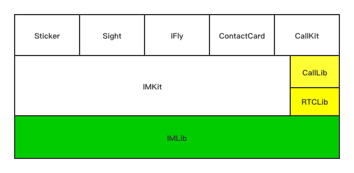

# 一. 简介

## 1.目标说明

**目的是为了让开发者可以通过 pod 进行 `framework` 和 `源码` 两种形式切换，融云 UI SDK 以 pod 方式开源**

**基于现有的 `RongCloudIM` 与 `RongCloudRTC` 两个 pod， 增加一个新的 pod 仓库 `RongCloudOpenSource`**

RongCloudIM 和 RongCloudRTC 里面 SDK 都以 framework 形式存在

RongCloudOpenSource 里面 SDK 都以源码形式存在，主要包含各个 UI SDK 的源码


```
警告：
建议开发者参考我们各个 UI SDK 的源码实现，以继承方式，在子类中重写父类方法实现自定义相关功能
强烈不建议直接修改 SDK 源码，避免后续版本升级导致修改被重置
```

## 2. 架构说明



**绿色部分的 SDK 是以 `framework` 形式存在，属于 RongCloudIM**

**黄色部分的 SDK 是以 `framework` 形式存在，属于 RongCloudRTC**

**白色部分的 SDK 是以 `源码` 形式存在，只属于 RongCloudOpenSource**


podfile 引入 RongCloudOpenSource 默认就可以引入这些 SDK

名称| 可选与否|含义
:---|:---|:---
IMKit|可选|IM UI 能力库，含会话列表页面，会话页面，输入工具栏
Sticker|可选|表情 SDK
Sight|可选|小视频 SDK
IFly|可选|语音输入 SDK
ContactCard|可选|名片 SDK
CallKit|可选|音视频 UI 库

## 3. 引入方式说明

支持 framework 和 源码 两种引入方式

如果需要在 framework 和 源码两种方式之间切换需要涉及 podfile 的声明 和 APP 项目的引入问题，可以参见下面的内容

### 3.1 引入 framework

> podfile

```
pod 'RongCloudIM/IMKit',5.0.0           # IMKit
pod 'RongCloudIM/Sight',5.0.0           # 小视频
pod 'RongCloudIM/RongSticker',5.0.0     # 表情

pod 'RongCloudRTC/RongCallKit',5.0.0    # CallKit
```

> 项目 import

```
#import <RongIMKit/RongIMKit.h>
#import <RongSight/RongSight.h>
```

### 3.2 引入源码

> podfile

```
pod 'RongCloudOpenSource/IMKit',5.0.0           # IMKit
pod 'RongCloudOpenSource/Sight',5.0.0           # 小视频
pod 'RongCloudOpenSource/RongSticker',5.0.0     # 表情
pod 'RongCloudOpenSource/IFly',5.0.0            # 语音输入
pod 'RongCloudOpenSource/ContactCard',5.0.0     # 名片

pod 'RongCloudOpenSource/RongCallKit',5.0.0     # CallKit
```

> 项目 import

```
#import <RongCloudOpenSource/RongIMKit.h>
#import <RongCloudOpenSource/RongSight.h>
```

## 4. FAQ

> 找不到 RongCloudOpenSource 怎么办？

终端执行 pod repo update 即可