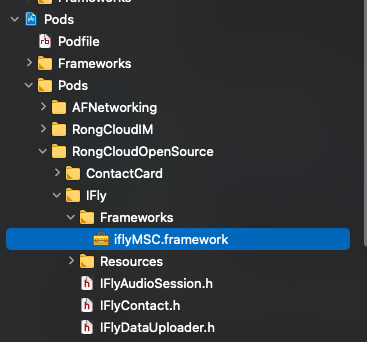
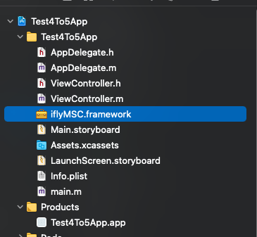

融云 IM 讯飞语音输入插件说明文档

`本讯飞输入插件依赖于 IMKit 和讯飞语音库 iflyMSC.framework`

因为讯飞语音库是收费业务，所以推送该仓库的时候已将融云内部使用的讯飞 appkey 删除，需要您自行去讯飞官网申请账号并下载 SDK

注：因为讯飞的 appkey 和 iflyMSC.framework 是强绑定关系，所以更换讯飞 appkey 必须同时更换 iflyMSC.framework

## 具体操作流程如下

> 步骤 1.申请讯飞账号并下载 SDK

[讯飞官网](https://www.xfyun.cn/doc/asr/voicedictation/iOS-SDK.html)

> 步骤 2.集成 RongCloudOpenSource 

> 步骤 3.设置讯飞 appkey

必须在 RCIM 的 initWithAppKey 前调用下面接口

```
[RCiFlyKit setiFlyAppKey:@"讯飞 appkey"];
```

> 步骤 4.删除 RongCloudOpenSource 里面的 iflyMSC.framework

Xcode 项目路径为 ：Pods -> Pods -> RongCloudOpenSource -> IFly -> Frameworks -> iflyMSC.framework



**该步骤有一张示意图，如果看不到图片，可通过图片原始路径查看**

图片原始路径: `images/ifly1.png`

> 步骤 5.App 依赖步骤 1 中下载的 iflyMSC.framework



**该步骤有一张示意图，如果看不到图片，可通过图片原始路径查看**

图片原始路径: `images/ifly2.png`


## FAQ

> 问题 1： RongCloudOpenSource 包含的 iflyMSC.framework 开发者能否直接使用？

答：不能；讯飞是收费业务，我们推源码的时候已经把融云的讯飞 appkey 删除，需要您自行去讯飞申请账号

> 问题 2：既然不能直接用 RongCloudOpenSource 的 iflyMSC.framework，为啥还要有这个 framework？

答：为了保证 pod 的推送：RongCloudOpenSource 是推送到 pod 上的，而融云的讯飞插件强制依赖 iflyMSC.framework，如果没有该 framework，则 pod
推送会报错

> 问题 3：为什么步骤 4 需要删除 iflyMSC.framework ？

答：上面讲的讯飞 appkey 和 iflyMSC.framework 是配对的，图中的 iflyMSC.framework 是和融云内部使用的在源码中被删除的讯飞 appkey 配对的，所以需要删除

> 问题 4：步骤 4 的删除是不是删除一次就可以了？

上述步骤，只有步骤 4 可能需要多次操作，其余步骤只需要处理一次

如果 RongCloudOpenSource 的版本进行变更，那么就需要执行步骤 4 手动删除一次，因为 pod 更新会重新加载该 framework，如果不删除可能会报多次引入 iflyMSC.framework 的错误